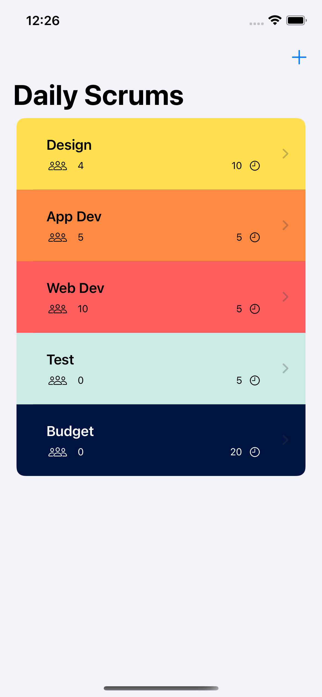

# Scrumdinger

This repository contains the code written during my course of taking the iOS app development tutorial.  

## Features
* List view with customizable cards
* Timer screen with audio alert for each speaker
* Data binding and stateful data

## Screenshots
|  |  |
|--|--|
|  |   |  